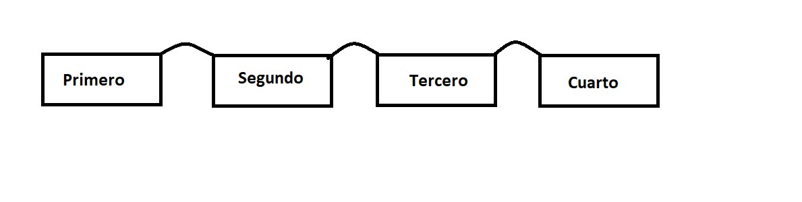

<div align="right">

</div>

# TDA Lista-Cola-Pila

## Repositorio de Santiago Henseler - 110732 - shenseler@fi.uba.ar

- Para compilar:

```bash
make pruebas_alumno
```

- Para ejecutar:
```bash
./pruebas_alumno
```

- Para ejecutar con valgrind:
```bash
make valgrind-alumno
```
---
##  ¿Qué es una lista?

Una lista es un T.D.A.(tipo de dato abstracto) que agrupa elementos, los cuales tienen un orden establecido, con predecesores(menos el primero) y sucesores(menos el ultimo).

<br />
<div align="center">

</div>

<br />

Al ser un T.D.A. esta completamente encapsulada y es imposible acceder a los elemento de la misma. Por eso se definen las siguientes operaciones:
`lista_crear()`, `lista_insertar()`, `lista_quitar()`, `lista_elemento_en_posicion()`, `lista_buscar_elemento()`, `lista_destruir()`, `lista_tamanio()`, un iterador externo, un iterador interno, entre otras funcionalidades extra que se le pueden añadir (como las que añadimos al T.D.A. en este trabajo).

<br />

La lista se puede implementar de 3 maneras distintas:

- Vector estatico: consiste en una lista con un campo declarado como vector, con su respectivo tamaño `[MAX_LISTA]` y otro campo con la cantidad de elementos `cant_elementos`. Esta implementacion nos restringe la cantidad de elementos a añadir a la lista por culpa del tamaño. El vector se declara con cierto tamaño y no se puede agrandar o achicar. 

```c
struct lista{
    void *lista_estatica[MAX_LISTA];
    int cant_elementos;
}
```
- Vector dinamico: consiste en una lista con un campo declarado como vector, con su respectivo tamaño `[MAX_LISTA]` y otro campo con la cantidad de elementos `cant_elementos`. Esta implementacion nos restringe la cantidad de elementos a añadir a la lista por culpa del tamaño. El vector se declara con cierto tamaño y no se puede agrandar o achicar. 


  

### Por ejemplo:

El programa funciona abriendo el archivo pasado como parámetro y leyendolo línea por línea. Por cada línea crea un registro e intenta agregarlo al vector. La función de lectura intenta leer todo el archivo o hasta encontrar el primer error. Devuelve un vector con todos los registros creados.

<div align="center">

</div>

En el archivo `sarasa.c` la función `funcion1` utiliza `realloc` para agrandar la zona de memoria utilizada para conquistar el mundo. El resultado de `realloc` lo guardo en una variable auxiliar para no perder el puntero original en caso de error:

```c
int *vector = realloc(vector_original, (n+1)*sizeof(int));

if(vector == NULL)
    return -1;
vector_original = vector;
```


<div align="center">

</div>

---

## Respuestas a las preguntas teóricas
Incluír acá las respuestas a las preguntas del enunciado (si aplica).
