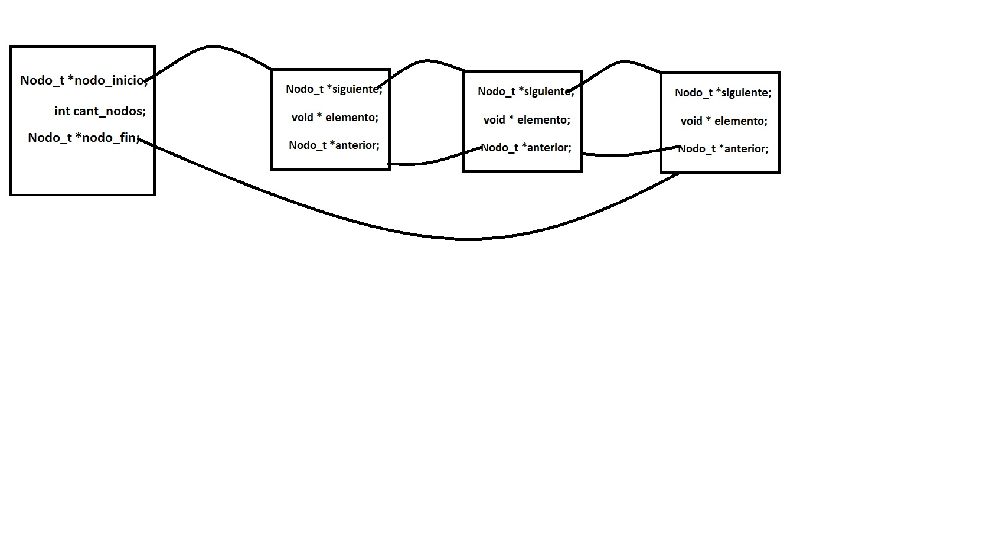

<div align="right">

</div>

# TDA Lista-Cola-Pila

## Repositorio de Santiago Henseler - 110732 - shenseler@fi.uba.ar

- Para compilar:

```bash
make pruebas_alumno
```

- Para ejecutar:
```bash
./pruebas_alumno
```

- Para ejecutar con valgrind:
```bash
make valgrind-alumno
```
---
##  ¿Qué es una lista?

Una lista es un T.D.A.(tipo de dato abstracto) que agrupa elementos, los cuales tienen un orden establecido, con predecesores(menos el primero) y sucesores(menos el ultimo).

<br />
<div align="center">

</div>

<br />

Al ser un T.D.A. esta completamente encapsulada y es imposible acceder a los elemento de la misma. Por eso se definen las siguientes operaciones:
`lista_crear()`, `lista_insertar()`, `lista_quitar()`, `lista_elemento_en_posicion()`, `lista_buscar_elemento()`, `lista_destruir()`, `lista_tamanio()`, un iterador externo, un iterador interno, entre otras funcionalidades extra que se le pueden añadir (como las que añadimos al T.D.A. en este trabajo).

<br />

La lista se puede implementar de 3 maneras distintas:

- Vector estatico: consiste en la implementacion de una lista con un campo declarado como vector, con su respectivo tamaño `[MAX_LISTA]` y otro campo con la cantidad de elementos `cant_elementos`. Esta implementacion nos restringe la cantidad de elementos a añadir a la lista por culpa del tamaño. El vector se declara con cierto tamaño y no se puede agrandar o achicar. 

```c
struct lista{
    void lista_estatica[MAX_LISTA];
    int cant_elementos;
}
```
- Vector dinamico: consiste en la implementacion de una lista con un campo declarado como puntero a un vector y otro campo con la cantidad de elementos `cant_elementos`. Esta implementacion no nos restringe la cantidad de elementos a añadir a la lista ya que mediante el uso de `realloc()` podemos ir agrandando su tamaño. El unico problema con esta implementación que la memoria almacenada deben ser bloques continuos de memoria, por lo tanto en situaciones donde se requiera mucha memoria o se disponga de poca puede fallar la implementación.
  
```c
struct lista{
    void *lista_estatica;
    int cant_elementos;
}
```
- Nodos: consiste en la implementacion de una lista como una serie de nodos enlazados los cuales contienen un valor y un puntero al siguiente nodo. De esta forma, todos los nodos quedan conectados mediante este puntero. La mayor ventaja que tiene es que utilizamos secciones separadas de memoria para cada nodo, descartando el problema de los vectores dinamicos.
```c
struct lista{
    nodo_t nodo_inicio*;
    int cant_elementos;
    nodo_t nodo_fin*;
}

```
A su vez los nodos se pueden implementar de dos maneras distintas:

# Nodos simplemente enlazados:
Cada nodo referencia solo a su sucesor(menos el ultimo)

```c
struct nodo_t{
    nodo_t siguiente_nodo*;
    void* elemento;
}
```
<div align="center">

</div>

- Ahora voy a analizar las distintas complejidades algoritmicas de la implementación con nodos simplemente enlazados:

-->Insertar al inicio o al final:

```
creo un nuevo nodo --> 1
asigno como siguiente al nuevo nodo el nodo que esta en primera posicion --> 1
asigno como primer nodo al nuevo --> 1
agrando la cantidad de nodos --> 1
```

<div align="center">

</div>

```c
// al final
	nodo_t *nodo = nuevo_nodo(elemento); --> 1

	if (lista_vacia(lista)) {
		lista->nodo_inicio = nodo; --> 1
		lista->nodo_fin = nodo; --> 1
	} else {
		lista->nodo_fin->siguiente = nodo; --> 1
		lista->nodo_fin = nodo; --> 1
	}

	lista->cant_nodos++; --> 1

// al inicio
    nodo_t *nodo = nuevo_nodo(elemento); --> 1

	if (posicion == 0) {
		nodo->siguiente = lista->nodo_inicio; --> 1
		lista->nodo_inicio = nodo; --> 1
	}

	lista->cant_nodos++;  --> 1


```
Contando todas las instrucciones, insertando al inicio o al final, se llega a la siguiente ecuación: `T(n) = 1+1+1+1`. Entonces tiene una complejidad de *O(1)* porque: `4 < N , ∀ N > 4`

<br>

-->obtener al inicio o al final:

```c
// Al final
    lista->nodo_fin; --> 1

// Al inicio
    lista->nodo_inicio; --> 1
```
Contando todas las instrucciones se llega a la siguiente ecuación: `T(n) = 1` . Entonces tiene una complejidad de *O(1)* porque: `1 < N , ∀ N > 1`
<br>

--> Borrar al inicio:

```
creo un puntero aux --> 1
apunto aux al nodo a borrar --> 1
asigno como primer nodo al segundo nodo --> 1
libero la memoria de aux --> 1
disminuyo la cantidad de nodos --> 1
```

<div align="center">

</div>

```c
	if (posicion == 0) {
		nodo_t *nodo_borrado = lista->nodo_inicio; --> 1

		lista->nodo_inicio = lista->nodo_inicio->siguiente; --> 1

		free(nodo_borrado); --> 1
		lista->cant_nodos--; --> 1

	}

```
Contando todas las instrucciones se llega a la siguiente ecuación: `T(n) = 1+1+1+1` . Entonces tiene una complejidad de *O(1)* porque: `4 < N , ∀ N > 4`
<br>

La complejidad algoritmica para las 3 operaciones con el primer elemento de la lista es *O(1)* porque tenemos a disposicion el puntero al primer elemento, lo que favorece a no tener que iterar toda la lista. Tambien se cumple que insertar y obtener al final es *O(1)* porque tambien tenemos el puntero al ultimo elemento. En cambio para borrar al final tenemos que recorrer hasta el anteultimo elemento, analizemos su complejidad:

-->Borrar al final:

```c
        nodo_t *nodo_borrado = lista->nodo_fin; --> 1

	nodo_t *ante_ultimo = posicion_nodo(lista->nodo_inicio, ((int)lista->cant_nodos) - 1); --> n-1

	lista->nodo_fin = ante_ultimo; --> 1
	lista->nodo_fin->siguiente = NULL; --> 1

	lista->cant_nodos--; --> 1
	free(nodo_borrado); --> 1
```

Contando todas las instrucciones se llega a la siguiente ecuación: `T(n) = 1+1+1+1+1+n-1` . Entonces tiene una complejidad de *O(n)* porque: `4+n < N , ∀ N > 4`
<br>

-->Insertar al medio:

```c
	if {
		nodo_t *posicion_a_insertar = posicion_nodo(lista->nodo_inicio, (int)posicion); --> n
		nodo->siguiente = posicion_a_insertar->siguiente; --> 1
		posicion_a_insertar->siguiente = nodo; --> 1
	}

	lista->cant_nodos++; --> 1
```
Contando todas las instrucciones se llega a la siguiente ecuación: `T(n) = 1+1+1n` . Entonces tiene una complejidad de *O(n)* porque: `3+n < N , ∀ N > 3`
<br>

-->Borrar al medio:

```c
	nodo_t *nuevo_nodo_fin = posicion_nodo(lista->nodo_inicio, (int)posicion); --> n

	nodo_t *nodo_borrado = nuevo_nodo_fin->siguiente; --> 1
	void *aux = nuevo_nodo_fin->siguiente->elemento; --> 1

	nuevo_nodo_fin->siguiente = nuevo_nodo_fin->siguiente->siguiente; --> 1

	free(nodo_borrado); --> 1
	lista->cant_nodos--; --> 1
``` 
Contando todas las instrucciones se llega a la siguiente ecuación: `T(n) = n+1+1+1+1+1` . Entonces tiene una complejidad de *O(n)* porque: `n+5 < N , ∀ N > 5`

<br>

-->Obtener al medio:

```c
nodo_t *nodo_en_pos = posicion_nodo(lista->nodo_inicio, (int)posicion + 1); --> n+1
``` 
Contando todas las instrucciones se llega a la siguiente ecuación: `T(n) = n+1` . Entonces tiene una complejidad de *O(n)* porque: `n+1 < N , ∀ N > 2`

- Nodos simplemente enlazados: Cada nodo referencia solo a su sucesor(menos el ultimo)
<br>

# Nodos doblemente enlazados:
Cada nodo referencia a su sucesor(menos el ultimo) y a su predecesor(menos el primero).

```c
struct nodo_t{
    	nodo_t siguiente_nodo*;
    	void* elemento;
	nodo_t anterior_nodo*;
}
```
<div align="center">

</div>
<br>
- Ahora voy a analizar las distintas complejidades algoritmicas de la implementación con nodos doblemente enlazados:

--> Insertar/obtener/eliminar al inicio: Mantiene la misma complejidad que en la otra implementación.
--> Insertar/obtener/eliminar al medio: Mantiene la misma complejidad que en la otra implementación.
--> Insertar/obtener al final: Mantiene la misma complejidad que en la otra implementación.
--> Eliminar al final:

```c
    	nodo_t *nodo_borrado = lista->nodo_fin; --> 1

	lista->nodo_fin = lista->nodo_fin->anterior_nodo; --> 1
	lista->nodo_fin->siguiente = NULL; --> 1

	lista->cant_nodos--; --> 1
	free(nodo_borrado); --> 1
```

Contando todas las instrucciones se llega a la siguiente ecuación: `T(n) = 1+1+1+1+1` . Entonces tiene una complejidad de *O(1)* porque: `5 < N , ∀ N > 5`
<br>
---
##  ¿Qué es una pila?

Es un T.D.A. en el cual almacenar elementos en un orden específico. La pila se caracteriza por ser una estructura de tipo LIFO (last-in, first-out), lo que significa que el último elemento que se insertó es el primero en salir. Para este tp implemente este T.D.A. a partir de la estructura del T.D.A. lista. 

- Ahora voy a analizar las distintas complejidades algoritmicas de la implementación de la pila:

--> En el T.D.A. pila se pueden insertar valores solo al final(push), implementandose de la misma manera que se implementa la insercion en las listas con nodos simplemente enlazados:
```c
    	(pila_t *)lista_insertar((lista_t *)pila, elemento);
```
==> Insertar al final de una pila es O(1).

--> Solo se puede borrar al final de una pila (pop). Tambien reutilizo la manera que se borra al final de una listas con nodos simplemente enlazados:
```c
    	lista_quitar((lista_t *)pila);
```
==> Borrar al final de una pila es O(1).

--> Solo podemos conocer el ultimo elemento de la pila, como en los anteriores, reutilizo el codigo de las listas con nodos simplemente enlazados:
```c
    	lista_ultimo((lista_t *)pila);
```
==> Obtener al final de una pila es O(1).

---
## ¿Qué es una cola?
Al igual que la pila, una cola es un T.D.A. que nos permite almacenar elementosen un orden específico. Se caracteriza por ser una estructura FIFO (first-in, first-out), lo que significa que el primer elemento que se insertó es el primero en salir.

- Ahora voy a analizar las distintas complejidades algoritmicas de la implementación de la cola:

--> En el T.D.A. cola solo se pueden insertar valores al final(encolar), implementandose de la misma manera que se implementa la insercion en las listas con nodos simplemente enlazados:
```c
    	 (cola_t *)lista_insertar((lista_t *)cola, elemento);
```
==> Insertar al final de una cola es O(1).

--> Solo se puede borrar al inicio de una cola(desencolar). Tambien reutilizo la manera que se borra al final de una listas con nodos simplemente enlazados:
```c
    	 lista_quitar_de_posicion((lista_t *)cola, 0);
```
==> Borrar al final de una pila es O(1).

--> Solo podemos conocer el primer elemento de la cola, como en los anteriores, reutilizo el codigo de las listas con nodos simplemente enlazados:
```c
    	 lista_primero((lista_t *)cola);
```
==> Obtener al final de una cola es O(1).

